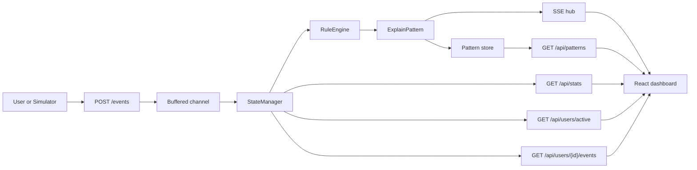
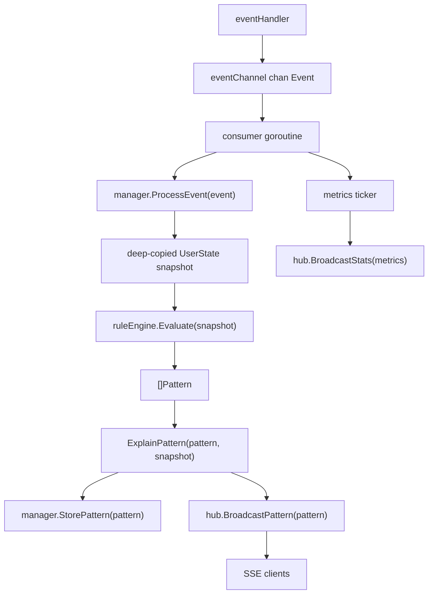
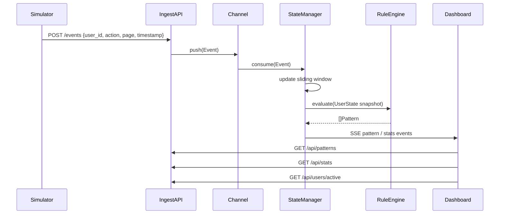
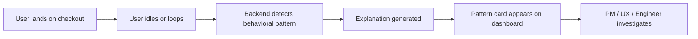

# Architecture

## High-Level Design

## Low-Level Design

## Engineering Sequence

## Consumer Flow

### Product flow

### Key tradeoffs

- In-memory state keeps the MVP simple and fast, but resets on restart.
- Rule-based detection is deterministic and interview-friendly, but less adaptive than ML.
- SSE is lighter than WebSockets for this one-way live feed.
